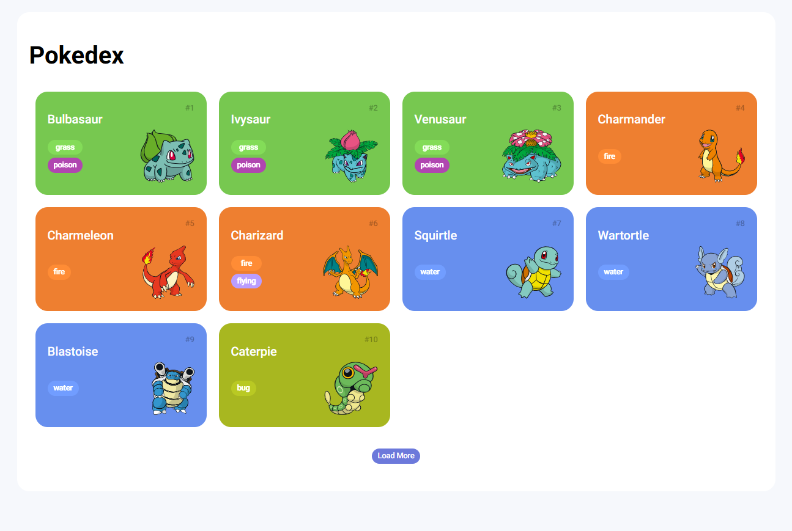
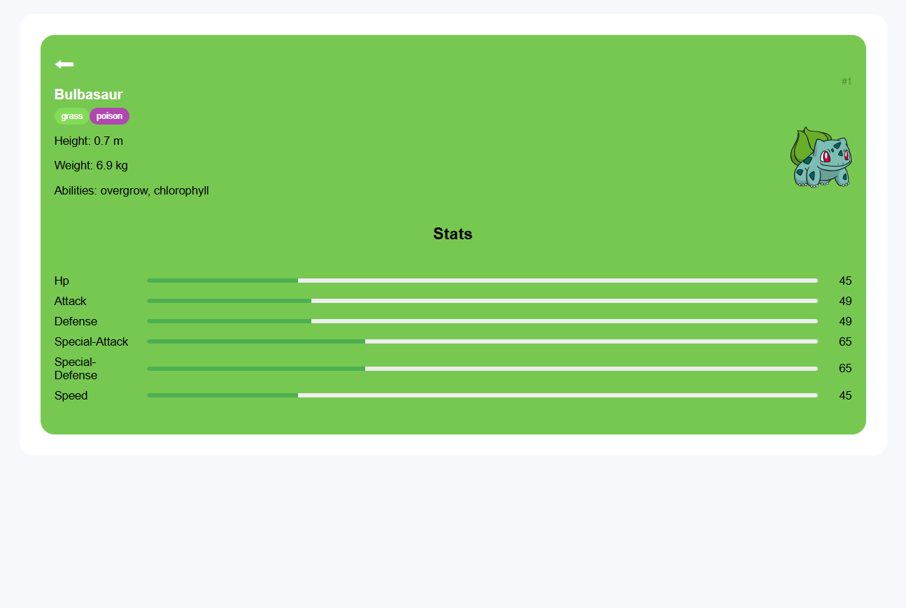

# Pokédex

Bem vindo(a) ao resultado do meu primeiro desafio na Trilha de Javascript da DIO! Onde construí uma Pokédex com HTML, CSS e Javascript.

Além de realizar o desafio, que era a implementação da tela onde são listados os Pokémons, eu fiz outra página para onde o usuário é encaminhado ao clicar em um dos Pokémons da lista. Essa nova página tem as mesmas informações do Pokémon que aparecem na lista, mas tem também algumas informações adicionais. 

[Clique aqui]() para acessar o resultado final da página criada por mim a partir do desafio da DIO!

